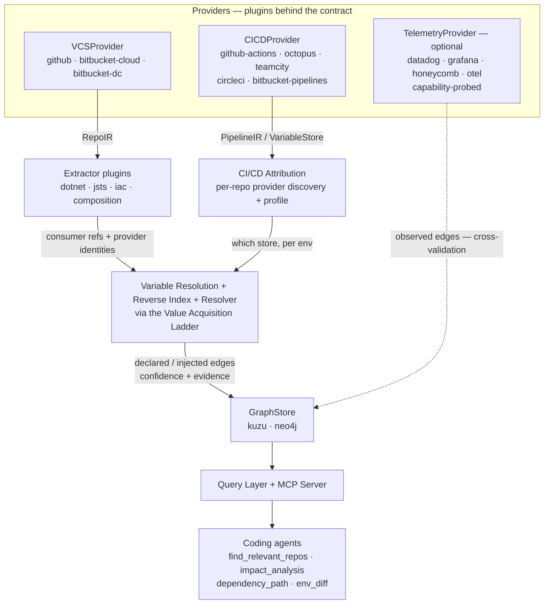

# Tendril — Architecture

The canonical architecture diagram, committed as source (FR-20). Renders on GitHub. See `SPEC.md` for the component detail and `PRD.md` for requirements.

## Three planes, one plugin boundary

Tendril reconstructs the inter-repo dependency graph from three data planes — **source**, **build/deploy**, and (optional) **runtime** — with everything platform-specific behind the provider plugin contract (`SPEC.md §4`).

## How to read it

1. **Providers (plugins)** ingest each plane. Source = repos and files. Build/deploy = pipelines and variable stores. Runtime = observed telemetry (probed for capabilities; never required).
2. **Extractors** derive each repo's *consumer references* and *provider identities*; **Attribution** discovers which CI/CD system owns each repo, per environment, and therefore which variable store resolves its tokens.
3. **Resolution** evaluates tokens (via the acquisition ladder), builds the global **reverse index** of provider identities, and **joins** consumer references to providers — producing per-environment `DEPENDS_ON` edges with confidence and evidence.
4. **Telemetry** (dashed) overlays *observed* edges to cross-validate, lift confidence, and catch dynamic/secret-hidden dependencies static analysis can't see.
5. **GraphStore → Query/MCP** serves the result to coding agents, every answer carrying provenance (`declared` / `injected` / `observed`) and confidence.

## The two load-bearing ideas

- **The projection join.** An edge exists where one service's consumer reference ("I call X") matches another's provider identity ("I am reachable as Y"), scoped to an environment.
- **Index globally, traverse from the anchor.** Provider-identity indexing spans the whole configured scope (you can't know up front who provides a URL); consumer traversal is bounded to what's reachable from the anchor.
