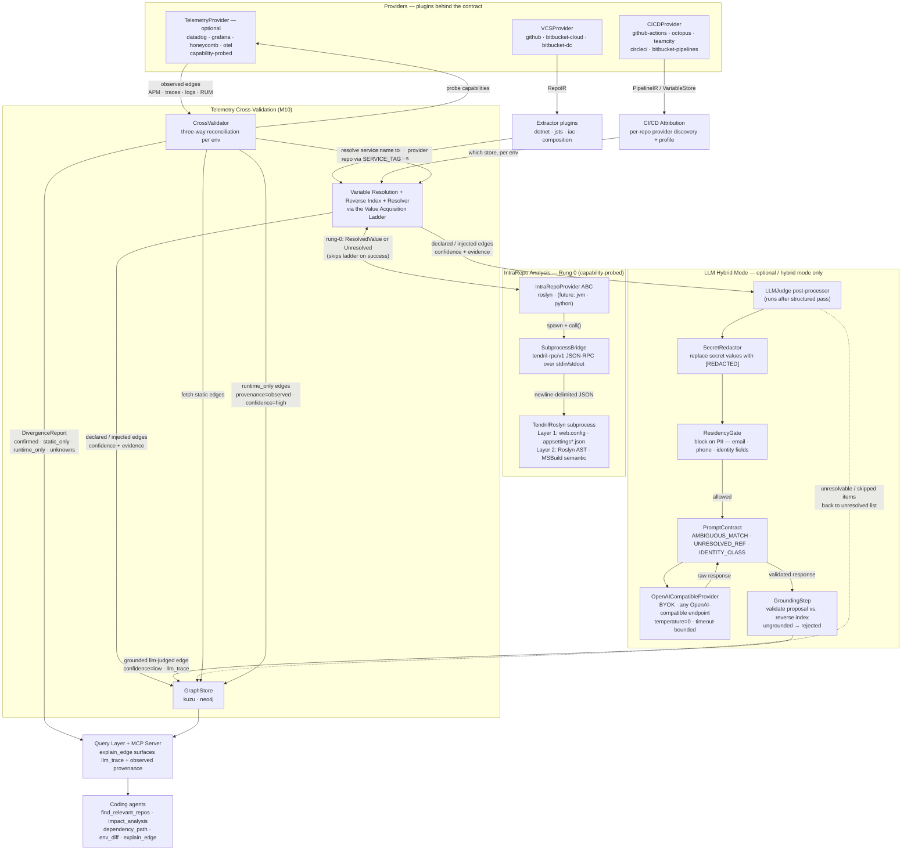

# Tendril-Graph — Architecture

The canonical architecture diagram, committed as source (FR-20). Renders on GitHub. See `SPEC.md` for the component detail and `PRD.md` for requirements.

## Three planes, one plugin boundary

Tendril-Graph reconstructs the inter-repo dependency graph from three data planes — **source**, **build/deploy**, and (optional) **runtime** — with everything platform-specific behind the provider plugin contract (`SPEC.md §4`).

## How to read it

1. **Providers (plugins)** ingest each plane. Source = repos and files. Build/deploy = pipelines and variable stores. Runtime = observed telemetry (probed for capabilities; never required).
2. **Extractors** derive each repo's *consumer references* and *provider identities*; **Attribution** discovers which CI/CD system owns each repo, per environment, and therefore which variable store resolves its tokens.
3. **IntraRepo Analysis (Rung 0)** is an optional capability-probed step that runs *before* the acquisition ladder. The `IntraRepoProvider` ABC (e.g. `RoslynIntraRepoProvider`) uses a language-specific subprocess via `SubprocessBridge` (tendril-rpc/v1 JSON-RPC over stdin/stdout) to resolve config-file and AST-level values directly within a repo. On success it returns a high-confidence `ResolvedValue` that short-circuits the ladder; on miss or failure it degrades gracefully and the acquisition ladder continues.
4. **Resolution** evaluates tokens (via the acquisition ladder), builds the global **reverse index** of provider identities, and **joins** consumer references to providers — producing per-environment `DEPENDS_ON` edges with confidence and evidence.
5. **LLM Hybrid Mode** (optional, `--mode hybrid`) is a post-processor that runs *after* the structured pass. `LLMJudge` picks up items the structured pass left unresolved or ambiguous, routes them through `SecretRedactor → ResidencyGate → PromptContract → OpenAICompatibleProvider`, then validates every proposal via `GroundingStep` before writing an edge. Ungrounded proposals are discarded. LLM-judged edges carry `provenance=llm-judged`, `confidence=low`, and a `llm_trace` reference to the persisted reasoning trace. Structured-mode edges are never modified.
6. **Telemetry Cross-Validation** (M10) runs the `CrossValidator` reconciliation pipeline per environment: probe Datadog capabilities (APM/traces/logs/RUM), fetch observed edges, resolve service names to repos via `SERVICE_TAG` identities in the reverse index, deduplicate edges (merging evidence), then compute three sets — **confirmed** (static + runtime agree), **static_only** (declared but no traffic observed), **runtime_only** (undeclared but actively communicating). Runtime-only edges are written to the graph store with `provenance=observed`, `confidence=high`, and Datadog evidence locators. Missing capabilities degrade gracefully without failing the run.
7. **GraphStore → Query/MCP** serves the result to coding agents, every answer carrying provenance (`declared` / `injected` / `observed` / `llm-judged`) and confidence. `explain_edge` surfaces the `llm_trace` reasoning for any LLM-judged edge, and `provenance=observed` for runtime-discovered edges.

## The two load-bearing ideas

- **The projection join.** An edge exists where one service's consumer reference ("I call X") matches another's provider identity ("I am reachable as Y"), scoped to an environment.
- **Index globally, traverse from the anchor.** Provider-identity indexing spans the whole configured scope (you can't know up front who provides a URL); consumer traversal is bounded to what's reachable from the anchor.
