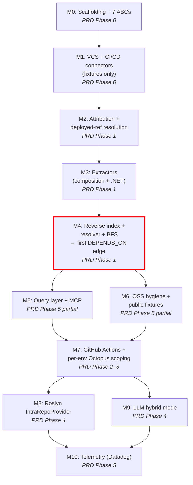

# Tendril-Graph: Spec Critique + Implementation Plan

## Context

Tendril-Graph is in pre-scaffolding state (design docs only, no code). This plan:
1. Critiques `SPEC.md` as a skeptical senior engineer — gaps, ambiguities, failure modes
2. Produces a phased, buildable implementation plan mapped to `PRD.md §10`
3. Resolves `SPEC.md §17` open questions where possible

The v0 target stack: ASP.NET WebForms (VB+C#) + Angular, built in TeamCity, deployed via Octopus, stored in Bitbucket + GitHub.

---

## Part 1: Spec Critique

### CRITICAL — Blocks correctness if unaddressed

**C1. `acquire()` has no `ref` parameter — deployed-ref not threaded through resolution (`§9`)**

`VCSProvider.read_file(repo, ref, path)` in §4.2 already accepts `ref` — so the VCS interface is correct. But the `acquire()` pseudocode in §9 passes `(T, R, E)` with no `ref`, and the rung-1 call (`static config in repo`) doesn't say which ref to read. This means the acquisition ladder silently reads from whatever ref the VCS connector defaults to (likely `HEAD`), breaking FR-24.

**Fix:** Change `acquire(T, repo R, env E)` → `acquire(T, repo R, env E, ref: str | None)`. Rung 1 calls `read_file(repo, ref, path)` with the deployed ref from `DeployedRef` resolution. Rungs 2-4 (variable store / preview / deploy logs) reflect current platform state — no `ref` applies — but should carry `effective_at: timestamp` where the platform provides it (Octopus audit logs do). Document the distinction: source reads use the deployed ref; store reads reflect current state with a staleness caveat in evidence.

**C2. Environment-name canonicalization is listed as "open" but is a Phase 0 blocker (`§17.3`)**

The resolver joins consumer references to provider identities *per environment*. Without a canonical environment dictionary, the BFS cannot join `github-env:"production"` to `octopus-env:"Prod"` to `tc-param:"prod"`. This is §17.3's open question, but it blocks Phase 1 (first real edge) entirely.

**Fix:** Close this in v0. Strategy: case-fold + configurable alias table:
```toml
[environments.prod]
aliases = ["production", "prd", "live", "Production", "PROD"]
```
Ship common defaults; adopter extends for their estate. Unmatched env names → `raw-name` + low confidence, never a resolution failure.

**C3. Deployable node creation is unspecified (`§2`, `§4.4`)**

The domain model has `Repo —PRODUCES→ Deployable`, and `DEPENDS_ON` runs between Deployables, not Repos. But nothing specifies how Deployable nodes are created. The extractor interface (§4.4) returns `{consumer_refs, provider_identities, token_decls}` — no `Deployable[]`. The CI/CD provider (§4.3) returns `PipelineBinding` which has `repo` but no explicit Deployable. The traversal pseudocode in §10 uses `repo` throughout, conflating it with Deployable.

This matters because a single repo can produce multiple deployables (e.g., a solution with a web app + a background job), each with different provider identities and environments. Collapsing Repo = Deployable silently drops this multiplicity.

**Fix:** Add `Deployable` discovery as a concern of attribution + extraction:
- CICDProvider: deploy targets per project/pipeline → Deployable nodes (Octopus project, TeamCity build config with deploy step)
- ExtractorPlugin: add optional `deployables(repo_ir) -> Deployable[]` method (default: one deployable per repo — the common case)
- For v0, default to 1:1 Repo:Deployable unless the CI/CD profile indicates otherwise (Octopus projects map to deployables naturally). Flag multi-deployable repos for manual review.

**C4. Deploy-step detection is under-specified (`§7`)**

The spec says "detect deploy-step detection inside a build workflow" but doesn't specify:
- The actual signature catalog (which action IDs, step names, task types)
- Multi-env multi-step pipelines (a pipeline that deploys to staging *then* prod)
- What happens when detection confidence is low
- The CICDProfile output schema

**Fix:** Ship `deploy_step_signatures.yaml` as a versioned data file in core (not embedded in code). Entries: `{provider_id, match_type(action_id|task_type|step_name_pattern), pattern, env_extraction_hint}`. Unknown mechanism → attribute build owner only, set `deploy_owner_confidence=low`, emit `unattributed-deploy` flag.

**C5. Plugin ABI is language-neutral pseudocode only (`§4.9`, `§17.8`)**

§4.9 mentions "Python entry points, npm package convention" but doesn't settle the reference language, how a Python core loads a non-Python plugin, or whether the ABI is in-process or subprocess. The conformance suite cannot be implemented without this.

**Fix:** See Part 3 (Decisions). Resolved: **Python 3.12+**, subprocess JSON-RPC for non-Python plugins.

---

### HIGH — Correctness/completeness degraded

**H1. `ServiceIdentity` (§3) vs `ProviderIdentity` (§4.1) — two concepts, unclear relationship**

§3 defines `ServiceIdentity` as a canonical node carrying aliases across identity classes. §4.1 defines `ProviderIdentity` as an IR type output by extractors. The spec never says how `ProviderIdentity` records become `ServiceIdentity` nodes, whether they're merged, or what resolves conflicts when two repos claim the same identity.

**Fix:** Clarify: `ProviderIdentity` is the raw extraction output (per-repo, per-extractor). During global indexing, ProviderIdentities are canonicalized and merged into `ServiceIdentity` nodes using the §3 alias resolution rules. Conflicts (two repos claim the same host) → both linked with `ambiguous: true`. The reverse index (§8) is keyed by ServiceIdentity, not raw ProviderIdentity.

**H2. Traversal pseudocode conflates structured and agentic mode (`§10`)**

The pseudocode shows the structured-mode path, then says "By default (hybrid/agentic modes) the per-node step is not a fixed extractor sweep." The default is `hybrid` (§15.1) but the pseudocode represents `structured`. A reader implementing from the pseudocode builds the wrong default.

**Fix:** Add mode dispatch:
```
evaluate_node(repo, env, mode):
    if mode == structured:  [current pseudocode]
    if mode in (hybrid, agentic):  [LLM loop from §15.2, using structured as fallback]
```
`hybrid` runs the structured fast-path first, escalates to LLM only for unresolved/ambiguous refs.

**H3. No `DeployedRef` as a first-class graph node (`§2`)**

The deployed SHA is recorded "on every edge as evidence," but isn't a queryable node. For multi-env queries ("diff prod vs staging"), the deployed SHA per env per Deployable must be queryable — not buried in edge evidence blobs.

**Fix:** Add node: `DeployedRef { sha, branch, env, deployable_id, deploy_timestamp, source: deploy_run_id }`. Edge: `Deployable —DEPLOYED_AS→ DeployedRef @env`.

**H4. Incremental invalidation cascade is unbounded (`§14`)**

"A provider identity change may invalidate others' inbound edges" — but no reverse tracking exists. Without it, every provider-identity change requires a full graph scan.

**Fix:** Maintain a `resolved_via` index on `DEPENDS_ON` edges pointing to the `ServiceIdentity` nodes used in resolution. On identity change, invalidate only edges resolved via the changed identity. Mark invalidated edges `stale` (don't delete).

**H5. Ambiguous-candidate BFS behavior unspecified (`§3`)**

§3 says "emit both candidates; ambiguity is surfaced, never auto-resolved." But: does BFS continue with all candidates (can explode), one (biased), or neither (blocks traversal)?

**Fix:** BFS continues with **all** candidates at `confidence=low`, edge carries `ambiguous: true` and `candidates: [list]`. Query layer surfaces with an `ambiguous` flag. Owner resolves via config override (canonical identity map) which promotes confidence.

---

### MEDIUM — Implementation guidance gaps

**M1. Evidence budget for LLM undefined (`§15.2`/`§15.7`)**

`evidence = gather(repo)` gives no budget. A 500-file monorepo could produce enormous context. Without a budget: cost explodes, context windows overflow.

**Fix:** Define `evidence_budget` in `LLMRequest`: `max_files`, `max_bytes`. Priority order: CI/CD profile + attribution → extractor output → deploy config → N most-relevant source files (ranked by extractor confidence). Source files pass through the residency gate.

**M2. Browser fallback (rung 5) should not ship in v0 (`§9`)**

Per `archive-context/value-acquisition.md`, browser automation inverts every property of the read-only/least-privilege security posture. The spec gates it but even with gates, it violates the spirit of read-only. Rungs 1-4 cover the target stack well.

**Fix:** Remove rung 5 from v0 scope. Mark `(planned, v1+)` with a security review gate.

**M3. `Endpoint` node usage in the pipeline is unclear (`§2`)**

§2 defines `Endpoint` nodes and `Deployable —EXPOSES→ Endpoint @env` / `Deployable —CONSUMES→ Endpoint @env`, with `Endpoint —RESOLVES_TO→ Deployable @env` as "the join result." But the traversal in §10 skips this intermediate layer entirely — going straight from consumer ref → reverse index → `DEPENDS_ON`. Are Endpoint nodes actually materialized, or is DEPENDS_ON the only persisted edge?

**Fix:** Clarify: in v0, `DEPENDS_ON` is the materialized edge. `EXPOSES`/`CONSUMES`/`RESOLVES_TO` edges are created as intermediate artifacts during resolution but their persistence is optional (useful for `explain_edge`). The Endpoint node is created when a consumer ref or provider identity resolves to a concrete URL/host — it's the evidence chain, not the primary query surface.

---

### LOW — Clarity/polish

**L1. `ConfigVar` vs `TokenDecl` relationship unclear (`§2`, `§4.1`)**

**Fix:** Add to §2: "ConfigVar nodes are persisted TokenDecl records; the `INJECTED_INTO` edge is created when a token resolves against a variable store."

**L2. TeamCity CVE warning has no action (`§5`)**

**Fix:** Read TeamCity version from `/app/rest/server`; emit `cicd-version-warning` on the provider node if below a documented minimum. The run continues.

---

## Part 2: Implementation Plan

### Language & Tooling Decisions

| Decision | Choice | Rationale |
|---|---|---|
| Reference language | **Python 3.12+** | Kùzu first-class bindings; LiteLLM native; pytest for conformance suite; `importlib.metadata` for plugin discovery |
| Non-Python plugins | Subprocess JSON-RPC (`tendril-rpc/v1`) | Roslyn C# analyzer runs as child process; any language can implement the wire protocol over stdin/stdout |
| Plugin ABI | Python ABCs + `tendril-plugin.toml` manifest | In-process for Python; subprocess bridge for others |
| Graph store | **Kùzu (embedded)** | No concurrency needs in v0; no external service; Cypher-compatible; `GraphStore` ABC is the only code that knows it's Kùzu |
| Contract version | `1.0.0-alpha` | Semver'd from day one |

### Milestone flow



**M4 is the "first real edge" gate** — the smallest deliverable that proves the core mechanism end-to-end.

---

### M0 — Scaffolding + all 7 seams *(PRD Phase 0)*

**Goal:** Runnable Python package with all seven plugin ABCs, Kùzu GraphStore, CLI skeleton, plugin discovery. Zero business logic — every method raises `NotImplementedError`.

**Key files:**

| Path | What |
|---|---|
| `tendril/plugins/base.py` | 7 ABCs: `VCSProvider`, `CICDProvider`, `ExtractorPlugin`, `IntraRepoProvider`, `TelemetryProvider`, `GraphStore`, `LLMProvider` |
| `tendril/plugins/manifest.py` | Load + validate `tendril-plugin.toml`; discover via `importlib.metadata` |
| `tendril/plugins/registry.py` | Capability negotiation, version checking |
| `tendril/models/ir.py` | All §4.1 shared IR types as dataclasses: `RepoRef`, `FileEntry`, `Evidence`, `ConsumerRef`, `ProviderIdentity`, `TokenDecl`, `VarEntry`, `VariableStore`, `PipelineBinding`, `CICDProfile`, `DeployedRef` |
| `tendril/models/graph.py` | Graph node/edge types matching §2: `Repo`, `Deployable`, `Environment`, `ServiceIdentity`, `ConfigVar`, `Endpoint`, `DeployedRef`; edge types: `DependsOn`, `Exposes`, `Consumes`, `ResolvesTo`, etc. |
| `tendril/store/kuzu_store.py` | Kùzu adapter: `upsert_node`, `upsert_edge`, `query`; schema from §2 |
| `tendril/core/environment.py` | `EnvironmentCanonicalizer` — case-fold + alias table from `environments_default.yaml` |
| `tendril/cli/main.py` | `tendril providers list`, `tendril graph build`, `tendril query`, `tendril serve --mcp` (stubs) |
| `data/deploy_step_signatures.yaml` | Initial deploy-action signature catalog |
| `data/environments_default.yaml` | Default environment alias map |
| `tests/conformance/` | Pytest abstract test classes per interface |
| `pyproject.toml` | Package config, entry points, dev dependencies |

**Acceptance:** `python -m tendril --help` works. A `FakePlugin` in `tests/fixtures/` registers via entry point, appears in `tendril providers list`, passes the conformance skeleton. Kùzu upsert + query round-trips.

---

### M1 — VCS + CI/CD connectors against fixtures *(PRD Phase 0)*

**Goal:** Four connectors passing conformance tests against recorded fixtures. No live API calls.

**VCS connectors:**
- `tendril/connectors/vcs/bitbucket_dc.py` — `BitbucketDCProvider`: auth (HTTP access token), `list_repos`, `read_tree`, `read_file(repo, ref, path)` (ref is explicit per §4.2)
- `tendril/connectors/vcs/github.py` — `GitHubProvider`: GitHub App + PAT, same interface
- Fixtures: `tests/fixtures/vcs/` — recorded JSON for a 3-repo estate (webforms-solution, landing-page-ui, landing-page-api)

**CI/CD connectors:**
- `tendril/connectors/cicd/teamcity.py` — `TeamCityProvider`: VCS roots (extrinsic repo→build mapping), build config parameters, password params (masked), version check
- `tendril/connectors/cicd/octopus.py` — `OctopusProvider`: spaces/environments/projects/deployments/variable sets (sensitive masked), effective-value preview API, deploy logs (rung 4)
- Fixtures: `tests/fixtures/cicd/` — recorded JSON for TC+Octopus

**Acceptance:** `pytest tests/conformance/ -k "bitbucket_dc or github or teamcity or octopus"` all green, no network calls.

---

### M2 — Attribution engine + deployed-ref resolution *(PRD Phase 1)*

**Goal:** Given a repo's file tree + CI/CD fixtures, produce a `CICDProfile` and resolve the deployed SHA per environment.

**Key files:**
- `tendril/core/attribution.py` — Attribution engine:
  - Intrinsic: scan for detector files (`.teamcity/`, `.github/workflows/`, `.octopus/`); parse deploy-step signatures from the data file
  - Extrinsic: TeamCity VCS root scan → build config → repo mapping
  - Output: `CICDProfile` per repo — environments, per-provider `{role[], confidence, evidence, env_scoping_source, variable_stores}`
  - Chaining: if intrinsic shows TC builds + Octopus deploys → chained profile with split build/deploy ownership
- `tendril/core/deployed_ref.py` — Octopus deployment → release → build metadata → VCS ref (SHA + branch); cache per env per project

**Acceptance:** Against fixtures: `attribute(webforms_repo_ir, tc_fixture, octopus_fixture)` → `CICDProfile(build_owner=teamcity, deploy_owner=octopus, envs=[prod, staging], deploy_confidence=high)`. `resolve_deployed_ref(profile, env=prod)` → `DeployedRef(sha=abc123, ...)`.

---

### M3 — Extractors (composition + .NET) *(PRD Phase 1)*

**Goal:** Locate and classify consumer refs + provider identities from the WebForms+Angular fixture without resolving.

**Key files:**
- `tendril/extractors/composition.py` — `CompositionExtractor`:
  - Scan `.aspx`, `.ascx`, `.master`, `.cshtml`, `.html`
  - Extract: `<iframe src=...>`, `<script src=...>`, `<link href=...>`, importmap entries
  - Token detection: `{t}`, `#{t}`, `${t}`, `%(t)%`, `<%$ AppSettings:t %>`
  - Output: `ConsumerRef[]` with `kind=iframe|script|composition`, `raw_value`, `token_refs[]`, `evidence`
- `tendril/extractors/dotnet.py` — `DotNetExtractor`:
  - Parse `appsettings.json`, `appsettings.{env}.json`, `web.config` + transforms
  - Extract: connection strings, HttpClient base addresses, WCF endpoints, service URLs
  - NuGet refs from `.csproj` → provider identities (artifact class)
  - Output: `ConsumerRef[]` + `ProviderIdentity[]` + `TokenDecl[]`
- `tendril/extractors/jsts.py` — `JSTSExtractor` (stub for v0, implement in v1)

**Acceptance:** Against fixtures: composition extractor finds `<iframe src="{landing-page-url}/dashboard-ui">` → `ConsumerRef(kind=iframe, raw_value="{landing-page-url}/dashboard-ui", token_refs=["landing-page-url"])`. .NET extractor finds `landing-page-url` token declaration in `appsettings.prod.json`.

---

### M4 — Reverse index + resolver + BFS → first real edge *(PRD Phase 1)*

**Goal:** End-to-end: anchor repo → one grounded `DEPENDS_ON@prod` edge with confidence, evidence, deployed SHA, and explicit unknowns.

**Key files:**
- `tendril/core/index.py` — `ReverseIndex`:
  - Built from all `ProviderIdentity` records across the configured scope
  - Canonicalize via §3 alias resolution → `ServiceIdentity` nodes
  - `lookup(value, env) -> [(Deployable, identity_class, confidence, evidence)]`
  - In-memory for v0; persisted to Kùzu
- `tendril/core/resolver.py` — Variable resolution (`acquire` with ref parameter — fixes C1):
  - `acquire(token, repo, env, profile, ref) -> (value, rung, evidence)`
  - Rung 1: `VCSProvider.read_file(repo, ref, path)` — reads at deployed ref
  - Rung 2: `CICDProvider.read_variable_store` + env scoping
  - Rung 3: `CICDProvider.read_effective_value` (preview API)
  - Rung 4: `CICDProvider.read_deploy_logs` → parse for effective values
  - Secret floor: `is_secret=True` → `UNRESOLVED_SECRET + evidence`
  - Rung 5 (browser): **removed from v0**
- `tendril/core/traversal.py` — BFS traversal:
  - Structured mode only in v0
  - `seed → attribution → extract → for each env: resolve → index.lookup → DEPENDS_ON → enqueue`
  - Cycle detection via `expanded` set (edges still recorded)
  - Confidence: `min(profile.confidence, match_class_confidence)`
  - Ambiguous candidates: enqueue all, `ambiguous=True` on edge

**Acceptance:**
```bash
tendril graph build \
  --anchor bitbucket-dc:acme/webforms-solution \
  --env prod \
  --fixture-dir tests/fixtures/golden/
```
→ One `DEPENDS_ON@prod` edge in Kùzu: `webforms-solution → landing-page-ui`:
- provenance: `injected`
- confidence: `high`  
- evidence: `[home.aspx:12 (iframe), appsettings.prod.json:7 (token), octopus:var-preview (resolution), octopus:deploy-3217 (sha=abc123)]`
- unknowns: `[]`
- deployed_ref: `abc123`

---

### M5 — Query layer + MCP server *(PRD Phase 5 — pulled forward)*

**Goal:** `tendril serve --mcp` responds to all five agent query tools.

**Key files:**
- `tendril/query/engine.py` — Implements §13 queries against Kùzu:
  - `find_relevant_repos`, `impact_analysis`, `dependency_path`, `env_diff`, `explain_edge`
  - Every response carries `{confidence, provenance, deployed_ref, unknowns: []}`
- `tendril/mcp/server.py` — FastAPI-based MCP server exposing the five tools
- `tendril/mcp/schema.py` — JSON schemas for request/response

**Acceptance:** `tendril serve --mcp` + MCP client → `find_relevant_repos("checkout flow", env="prod")` returns the fixture graph with confidence + provenance.

---

### M6 — OSS hygiene + public fixtures *(PRD Phase 5 — pulled forward)*

**Goal:** Any contributor reproduces the first edge with no private credentials.

- `tests/fixtures/golden/` — synthetic 3-repo estate with anonymized but realistic Bitbucket DC, TeamCity, and Octopus fixtures + expected output (golden edge file)
- `docs/plugin-developer-guide.md`
- `CONTRIBUTING.md`, `LICENSE` (Apache-2.0)
- `CLAUDE.md` update — fill in install/build/test/run commands
- CI: GitHub Actions runs `pytest tests/` on every PR

**Acceptance:** Fresh checkout → `pip install -e ".[dev]"` → `pytest` passes all tests with no external credentials.

---

### M7 — GitHub Actions + per-env Octopus scoping *(PRD Phase 2–3)*

- `tendril/connectors/cicd/github_actions.py` — detect via `.github/workflows/*.yml`; GitHub Environments as env-scoping source
- Octopus variable scoping: full scope-match algorithm (env → role → tenant → channel priority)
- `tendril/connectors/cicd/bitbucket_pipelines.py` — stub/initial

**Acceptance:** GitHub-hosted fixture produces a `DEPENDS_ON@staging` edge. Octopus env-scoped value correctly overrides project default.

---

### M8 — Roslyn IntraRepoProvider *(PRD Phase 4)*

- `tendril/analyzers/roslyn/` — C# CLI tool exposing `IntraRepoProvider` via `tendril-rpc/v1` JSON-RPC over stdin/stdout
- `tendril/plugins/subprocess_bridge.py` — generic JSON-RPC subprocess ABI for non-Python plugins
- `tendril/connectors/intra/roslyn_subprocess.py` — Python wrapper

**Acceptance:** VB.NET `web.config` value resolved via Roslyn def-use chain without hitting the acquisition ladder.

---

### M9 — LLM hybrid mode *(PRD Phase 4)*

- `tendril/connectors/llm/openai_compat.py` — `LLMProvider` via OpenAI-compatible gateway; temp 0; BYOK
- `tendril/core/llm_judge.py` — pre-hook (redaction + residency), grounded tools, prompt contracts, post-hook (grounding), cache + trace
- `tendril/core/traversal.py` update — hybrid mode: structured fast-path → LLM for unresolved/ambiguous only
- Evidence budget: `max_files=20, max_bytes=50_000` per call

**Acceptance:** An ambiguous match routes to LLM judge, which grounds both candidates via reverse index, surfaces them as `ambiguous + low-confidence`, records the reasoning trace.

---

### M10 — Telemetry (Datadog) *(PRD Phase 5)*

- `tendril/connectors/telemetry/datadog.py` — `DatadogTelemetryProvider` with `probe()` per env
- `tendril/core/cross_validate.py` — three-way reconciliation (§11): static ∩ runtime, static − runtime, runtime − static; divergence report

---

## Part 3: Decisions & Open Questions

### Resolved

| § | Decision | Rationale |
|---|---|---|
| §17.8 | **Python 3.12+** | Kùzu/LiteLLM/pytest first-class; subprocess JSON-RPC for non-Python |
| §17.5 | **Kùzu embedded** | No concurrency needs in v0; Neo4j swap = one plugin |
| §17.3 | **Env canonicalization in v0** | Case-fold + alias table; no match → raw-name + low-confidence; never a failure |
| §17.6 | **Async edges: v1+** | `MessageChannel` node exists in §2; extraction deferred |
| §17.9 | **Roslyn (MIT) + Joern (Apache-2.0)** behind `IntraRepoProvider` | Fills .NET gap + cross-language; license-clean; CodeQL excluded; Semgrep CE excluded (intraprocedural only) |
| §17.1 | **Deploy-step detection via `deploy_step_signatures.yaml`** | Versioned data file; unknown → `unattributed-deploy` flag, run continues |
| §17.2 | **Octopus without CaC: artifact provenance + mapping table fallback** | Try artifact provenance; if unavailable, require user config; flag unconfirmed |
| §9 rung 5 | **Browser removed from v0** | Security regression; planned v1+ with security review gate |

### Escalated to owner

| § | Question | Why |
|---|---|---|
| §17.4 | **Identity collisions (blue/green, shared gateway)** | Config-override approach proposed; UX for human resolution step needs product design |
| §17.7 | **Confidence calibration** | Needs hand-labeled golden estate; only tunable against real data |
| §17.10 | **Cross-language/cross-process stitching** | Grounded LLM + telemetry is the approach; penalty values need calibration |

### PRD/SPEC conflicts

| FR | SPEC | Conflict | Resolution |
|---|---|---|---|
| FR-24 | §9 `acquire()` has no `ref` param | Source reads must use deployed SHA; pseudocode doesn't thread it | Add `ref` param to `acquire()` (§4.2 `read_file` already has it) |
| FR-27 | §4.9 plugin ABI is pseudocode only | Can't implement without a concrete ABI | Close §17.8: Python + subprocess bridge |
| §2 `DEPENDS_ON` is Deployable→Deployable | §10 traversal uses `repo` throughout | Repo ≠ Deployable; a repo can produce multiple deployables | v0: default 1:1; detect multi-deployable from CI/CD profile; flag for review |

---

## Verification

End-to-end (no private credentials):
```bash
pip install -e ".[dev]"
pytest tests/conformance/           # all 7 plugin interface suites
pytest tests/integration/           # golden-fixture first-edge test
tendril graph build \
  --anchor bitbucket-dc:fixture/webforms-solution \
  --env prod \
  --fixture-dir tests/fixtures/golden/
tendril query explain_edge <edge-id>
# Expected: DEPENDS_ON edge with provenance=injected, confidence=high,
#           deployed_ref=abc123, evidence chain, unknowns=[]
```